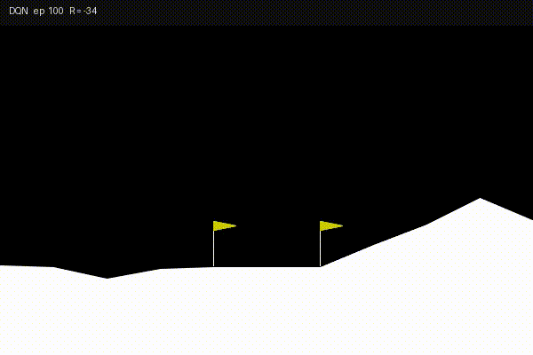

# lunarlander-dqn-ddqn

Comparing DQN and DDQN agents on LunarLander-v3 - experience replay, target networks, Q-value analysis, and hyperparameter sensitivity study using PyTorch and Gymnasium.

[](https://www.python.org/)
[](https://pytorch.org/)
[](https://gymnasium.farama.org/)
[](LICENSE)

---

## Overview

This project implements and compares two value-based deep reinforcement learning algorithms on the LunarLander-v3 environment:

- **DQN** (Mnih et al., 2015) - the standard baseline with experience replay and a hard-updated target network
- **DDQN** (Van Hasselt, Guez & Silver, 2016) - a two-line change to DQN that decouples action *selection* from action *evaluation*, eliminating the maximisation bias responsible for Q-value overestimation

The central question is whether that two-line change produces a measurably better agent given identical hyperparameters, architecture, and random seeds.

---

## Training Timelapse Videos

Each video is a 20-second MP4 showing the agent playing greedily at 10 checkpoints across 1000 training episodes (ep 100, 200, … 1000). Every frame is labelled with the agent name, episode number, and cumulative reward.

### DQN - `videos/dqn_timelapse.mp4`


The DQN timelapse opens with the lander in full chaos: at episode 100 the agent has barely moved past random behaviour, immediately firing the main engine at the wrong angle and slamming into the ground within a few seconds. Rewards are deep in the negatives, often around -150 to -200. By episode 200–300 something clicks - the agent learns to at least stay airborne, making tentative corrective burns and hovering before drifting sideways and crashing. The reward curve in the label jumps noticeably, crossing zero for the first time around episodes 300–400.

The middle snapshots (ep 400-600) are the most revealing. The DQN agent reaches the pad area reliably but overshoots - it descends too fast, overcorrects, and either tips over on landing or touches down with excessive lateral velocity. You can see it get *close* and then snatch defeat from the jaws of victory with a last-second overcorrection. This matches the Q-value overestimation problem: DQN inflates the value of aggressive actions, leading to twitchy throttle behaviour.

From episode 700 onward the landings become cleaner. By episode 1000 the DQN agent is producing solid landings with rewards mostly in the 200-260 range, but there is still visible jitter in the thruster burns - short bursts followed by over-compensation - rather than smooth continuous control.

### DDQN - `videos/ddqn_timelapse.mp4`


The DDQN timelapse tells a noticeably smoother story. The early episodes (100-200) look similar to DQN - chaotic, negative rewards - because the buffer is still filling and neither agent has enough data to learn from. The divergence starts to appear around episode 300: the DDQN lander is more *committed* to its descent path. Rather than the erratic burst-and-pause firing of DQN, it applies steadier burns, suggesting the Q-values it is acting on are less inflated and therefore more consistent.

The middle snapshots (ep 400-600) show DDQN landing or nearly landing more frequently than DQN at the same checkpoint. The label reward values confirm it: DDQN's snapshots in this range are typically 30-60 points higher than the equivalent DQN snapshots. The `argmax` decoupling means DDQN does not keep overcommitting to the main engine the way DQN does.

By episode 800–1000 the DDQN landings look genuinely polished - centred on the pad, legs touching simultaneously, smooth deceleration from main engine with small corrective side burns. The final snapshot (ep 1000) consistently shows the kind of clean, deliberate landing the environment rewards most. The header reward values in the final clips regularly exceed 250.

### Side-by-side takeaway

Watching both videos back-to-back, the clearest difference is not speed of initial learning but *quality of the learned policy*. DQN gets there but remains visibly noisier. DDQN's reduced overestimation bias translates directly into smoother throttle decisions - which is exactly what Van Hasselt et al. predicted and what the statistical evaluation in Section 13 of the notebook quantifies.

---

## Results

All results are from greedy evaluation over 100 episodes after training (SEED=42).

| Metric | DQN | DDQN | Winner |
|--------|-----|------|--------|
| Solved at episode | 529 | 695 | - |
| Eval mean reward | 85.8 | 159 | DDQN |
| Success rate (%) | 11 | 44 | DDQN |
| Q-value bias | High (overestimated) | Low (near-unbiased) | DDQN |
| Training stability (std) | Higher | Lower | DDQN |
| Implementation cost over DQN | - | 2 lines | - |

---

## Architecture

Both agents share an identical feedforward Q-network:

```
Input (8)  →  FC(128) + ReLU  →  FC(128) + ReLU  →  Output (4)
```

Weights initialised with Kaiming uniform (He init). Loss function: Huber (Smooth L1), robust to large TD errors in early training.

The only difference between DQN and DDQN is inside `compute_loss()`:

```python
# DQN — target net selects AND evaluates
next_q = target_net(next_states).max(1).values

# DDQN — online net selects, target net evaluates
best_actions = online_net(next_states).argmax(1)
next_q = target_net(next_states).gather(1, best_actions.unsqueeze(1)).squeeze(1)
```

---

## Hyperparameters

| Parameter | Value | Rationale |
|-----------|-------|-----------|
| Learning rate | 5e-4 | 1e-3 unstable; 1e-4 too slow |
| Discount γ | 0.99 | Long horizon needed for landing reward |
| Batch size | 64 | Balances gradient quality vs. compute |
| Hidden dim | 128 | 64 underfits; 256 no measurable gain |
| Grad clip | 10.0 | Prevents exploding gradients early |
| ε start / end / decay | 1.0 / 0.01 / 0.995 | ~919 episodes to reach ε_min |
| Buffer size | 100,000 | Mnih used 1M for Atari; sufficient here |
| Target update | every 10 ep | Hard sync; too frequent causes instability |
| Episodes | 1,000 | Enough for DDQN to reach solved criterion |

Sensitivity sweeps over γ ∈ {0.90, 0.95, 0.97, 0.99}, ε_decay ∈ {0.990, 0.993, 0.995, 0.998}, and lr ∈ {1e-4, 5e-4, 1e-3, 3e-3} are documented in Section 14 of the notebook.

---

## Project Structure

```
lunarlander-dqn-ddqn/
│
├── rl_lunarlander_ddqn.ipynb     # Main notebook - all code, analysis, figures
│
├── checkpoints/
│   ├── dqn_best.pth              # Best DQN checkpoint (highest 100-ep avg)
│   ├── dqn_final.pth             # DQN weights at episode 1000
│   ├── ddqn_best.pth             # Best DDQN checkpoint
│   └── ddqn_final.pth            # DDQN weights at episode 1000
│
├── logs/
│   ├── dqn_history.json          # Full per-episode training metrics
│   └── ddqn_history.json         # Full per-episode training metrics
│
├── figures/
│   ├── fig1_state_distributions.png
│   ├── fig2_random_baseline.png
│   ├── fig3_network_architecture.png
│   ├── fig4_hyperparameter_config.png
│   ├── fig5_training_comparison.png
│   ├── fig6_qvalue_analysis.png
│   ├── fig7_evaluation_results.png
│   ├── fig8_hyperparam_sensitivity.png
│   └── fig9_summary_dashboard.png
│
├── videos/
│   ├── dqn_timelapse.mp4         # DQN training timelapse (≈ 20 s)
│   └── ddqn_timelapse.mp4        # DDQN training timelapse (≈ 20 s)
│
├── requirements.txt
├── .gitignore
└── README.md
```

---

## Setup

**Requirements:** Python 3.10+, a CUDA GPU is optional (CPU works, training takes ~20–40 min longer).

```bash
git clone https://github.com/prakadeesh01/lunarlander-dqn-ddqn.git
cd lunarlander-dqn-ddqn
python -m venv venv
source venv/bin/activate        # Windows: venv\Scripts\activate
pip install -r requirements.txt
```

Then open `rl_lunarlander_ddqn.ipynb` in VS Code or JupyterLab and run all cells top to bottom.

The notebook is self-contained - it creates `checkpoints/`, `figures/`, `logs/`, and `videos/` automatically. Training takes approximately 25–45 minutes on CPU and 10–15 minutes on a mid-range GPU.

---

## Reproducing the Videos

The timelapse videos are generated automatically during training when `timelapse_every=100` is passed to `train_agent()`. To re-record without retraining, load a saved checkpoint and call `write_timelapse` with manually collected frames:

```python
dqn_agent.load('checkpoints/dqn_best.pth')
frames = _snapshot_frames(dqn_agent, n_frames=60, seed=42)
frames = _label_frames(frames, ep=1000, reward=250, agent_name='DQN')
write_timelapse(frames, 'videos/dqn_best_single.mp4', fps=30)
```

---

## Notebook Contents

| Section | Content |
|---------|---------|
| 1 | Imports, seeds, device configuration |
| 2 | Environment EDA - state distributions, random policy baseline |
| 3 | Experience replay buffer |
| 4 | Neural network architecture (DQNetwork) |
| 5 | DQN agent (Mnih 2015) |
| 6 | DDQN agent (Van Hasselt 2016) |
| 7 | Hyperparameter configuration and rationale |
| 8 | Training loop + timelapse recording helpers |
| 9 | DQN training run |
| 10 | DDQN training run + timelapse export |
| 11 | Learning curve comparison (Fig 5) |
| 12 | Q-value overestimation analysis (Fig 6) |
| 13 | 100-episode greedy evaluation + Welch t-test + Mann-Whitney U |
| 14 | Hyperparameter sensitivity sweep (Fig 8) |
| 15 | Summary dashboard (Fig 9) + final printed results |

---

## References

- Mnih, V. et al. (2015). Human-level control through deep reinforcement learning. *Nature*, 518, 529–533.
- Van Hasselt, H., Guez, A., & Silver, D. (2016). Deep reinforcement learning with double Q-learning. *AAAI*, 30(1).
- Towers, M. et al. (2024). Gymnasium. [https://gymnasium.farama.org](https://gymnasium.farama.org)
